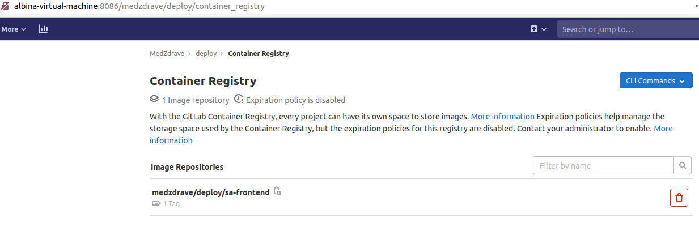

{}

# Migrate GitLab to new Host

## Install GitLab 11.11.0 version

Current GitLab version is 11.11.0:


We need to install the same version to server. Getlab can be installed from https://packages.gitlab.com/gitlab/gitlab-ce?page=71, additionally you  can take a look on official instruction to get information about Manually download and install a GitLab package:
https://docs.gitlab.com/omnibus/manual_install.html

```bash
wget --content-disposition https://packages.gitlab.com/gitlab/gitlab-ce/packages/ubuntu/bionic/gitlab-ce_11.11.0-ce.0_amd64.deb/download.deb

# root
sudo su

# Install and  setup openssh-server
apt-get install openssh-server
systemctl enable ssh
systemctl start ssh

# GitLab Community Edition
# Debian/Ubuntu
dpkg -i gitlab-ce_11.11.0-ce.0_amd64.deb

```

You should see this output:


Next step - setup and first run Gitlab

```bash
nano /etc/gitlab/gitlab.rb
```
Set external_url parameter to `'http://<hostname>:<port if needed>'`


Save changes and exit: Ctrl+S, Ctrl+X

Then we need to restart Gitlab by command:

```bash
gitlab-ctl reconfigure
```

Go to your site, in my case it is  http://localhost:8084/ and set `root` password, then sing in as root user


Check help page. The version should be the same


## Migrate projects

[Source](https://pikedom.com/migrate-gitlab-instance-to-new-host/)

### Creating backups

#### Backup GitLab directory

! It is important to get root user password

Go to source GitLab server and run:

```bash
sudo su
cd ~
mkdir GiLabMigrate
cd GiLabMigrate
sudo sh -c 'umask 0077; tar -cf $(date "+etc-gitlab-%s.tar") -C / etc/gitlab'
ls
```

This creates the following file in the current working directory.

```bash		
ls -la etc-gitlab-1601386671.tar
```

> -rw------- 1 root root 102400 May 16 19:47 etc-gitlab-1601386671.tar

With the following content.

```bash	
tar -tvf etc-gitlab-1601386671.tar
```

> drwxrwxr-x root/root         0 2020-09-29 13:46 etc/gitlab/
>
> -rw------- root/root     91815 2020-09-29 13:42 etc/gitlab/gitlab.rb
>
> -rw------- root/root     15370 2020-09-29 13:42 etc/gitlab/gitlab-secrets.json
>
> drwxr-xr-x root/root         0 2020-09-29 13:32 etc/gitlab/trusted-certs/


#### Application Backup

[Source](https://pikedom.com/migrate-gitlab-instance-to-new-host/)

By default, backups are kept in /var/opt/gitlab/backups. Check this setting

```bash	
grep backup_path /etc/gitlab/gitlab.rb
```
> gitlab_rails['manage_backup_path'] = true
>
> gitlab_rails['backup_path'] = "/var/opt/gitlab/backups"


If you change this location, be sure to run the below after.

```bash	
gitlab-ctl reconfigure
```

To actually take the application backup, run the following.

```bash
gitlab-rake gitlab:backup:create
```
This creates a backup in the following location.
	
```bash
ls -ltr /var/opt/gitlab/backups/
```

>total 1020
>
>-rw------- 1 git git 1044480 сен 29 16:54 1601387650_2020_09_29_11.11.0_gitlab_backup.tar

#### Prepare Zip

Lets zip and compress these files into a single archive for transfer. 
	
> /var/opt/gitlab/backups/1601387650_2020_09_29_11.11.0_gitlab_backup.tar
>
> ~/GiLabMigrate/etc-gitlab-1601386671.tar

Zip and compress with the following.

```bash
cp 	/var/opt/gitlab/backups/1601387650_2020_09_29_11.11.0_gitlab_backup.tar ~/GiLabMigrate/
tar -cvzf ~/gitlab-backup.tar.gz ~/GiLabMigrate/
```

## Application Backup Restore

[Source](https://pikedom.com/migrate-gitlab-instance-to-new-host/)

Stop processes


```bash
sudo su	
gitlab-ctl stop unicorn
gitlab-ctl stop sidekiq
gitlab-ctl status
```

Check they’re actually down.

```bash	
gitlab-ctl status | grep ^down
```

Move the application backup to the backups directory as defined in gitlab.rb and correct the owner if necessary.

```bash	
cp -v ~/GiLabMigrate/1601387650_2020_09_29_11.11.0_gitlab_backup.tar /var/opt/gitlab/backups/
chown -v git:git /var/opt/gitlab/backups/1601387650_2020_09_29_11.11.0_gitlab_backup.tar
```

Then restore. The restore name is the same as the above file name but without the _gitlab_backup.tar bit.

```bash		
gitlab-rake gitlab:backup:restore BACKUP=1601387650_2020_09_29_11.11.0
```	

Now restart GitLab.

```bash		
gitlab-ctl start
```

And check for problems.

```bash		
gitlab-rake gitlab:check SANITIZE=true
```

If all was successful, you should be able to log into the new site as before with whatever users you had setup. If you had 2FA enabled, you may need to restore the gitlab-secrets.json.

## Update GitLab version 

[PostgreSql and GitLab versions](https://docs.gitlab.com/omnibus/package-information/postgresql_versions.html) 

```bash
#optionally. New version will update it
sudo gitlab-ctl pg-upgrade

sudo gitlab-rake gitlab:env:info
```

You can run sudo gitlab-ctl pg-upgrade command one more time if version of DB in not 10.7

```bash
wget --content-disposition https://packages.gitlab.com/gitlab/gitlab-ee/packages/ubuntu/bionic/gitlab-ee_12.0.6-ee.0_amd64.deb/download.deb

sudo dpkg -i gitlab-ee_12.0.6-ee.0_amd64.deb 
```

Then update version to 12.10.9

```bash
wget --content-disposition https://packages.gitlab.com/gitlab/gitlab-ee/packages/ubuntu/bionic/gitlab-ee_12.10.9-ee.0_amd64.deb/download.deb

sudo dpkg -i gitlab-ee_12.10.9-ee.0_amd64.deb 
```

Then update to 13.0.x version

```bash
wget --content-disposition https://packages.gitlab.com/gitlab/gitlab-ee/packages/ubuntu/bionic/gitlab-ee_13.0.9-ee.0_amd64.deb/download.deb

sudo dpkg -i gitlab-ee_13.0.9-ee.0_amd64.deb 
```

> :warning: **Do not update to 13.4.1**: It removes migrated projects!

Last step - updating to **13.2.4** version

```bash
wget --content-disposition https://packages.gitlab.com/gitlab/gitlab-ee/packages/ubuntu/bionic/gitlab-ee_13.2.4-ee.0_amd64.deb/download.deb

sudo dpkg -i gitlab-ee_13.4.1-ee.0_amd64.deb 

sudo gitlab-ctl status
```
Check that all services are on run state

## Container Registry

[Source](https://docs.gitlab.com/ee/administration/packages/container_registry.html#configure-container-registry-under-an-existing-gitlab-domain)

[About Container Registry](https://docs.gitlab.com/ee/user/packages/container_registry/)

To turn Container Registry on, uncomment and edit registry_external_url

```bash
sudo su
gedit

# Open /etc/gitlab/gitlab.rb
# Edit  registry_external_url
```


```bash
gitlab-ctl reconfigure
```

Noy you are able to login, push and pull images:

```bash
 docker login albina-Virtual-Machine:5050

 docker build -t albina-Virtual-Machine:5050/medzdrave/deploy/sa-frontend .

 docker push albina-Virtual-Machine:5050/medzdrave/deploy/sa-frontend

 docker pull albina-Virtual-Machine:5050/medzdrave/deploy/sa-frontend
```




## Remove GitLab

[Source](https://askubuntu.com/questions/824696/is-it-fine-to-remove-the-opt-gitlab-directory-manually-after-removing-the-gitl)

