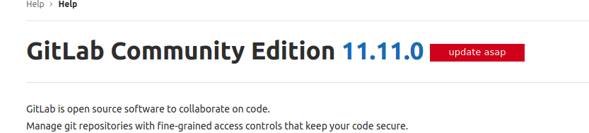
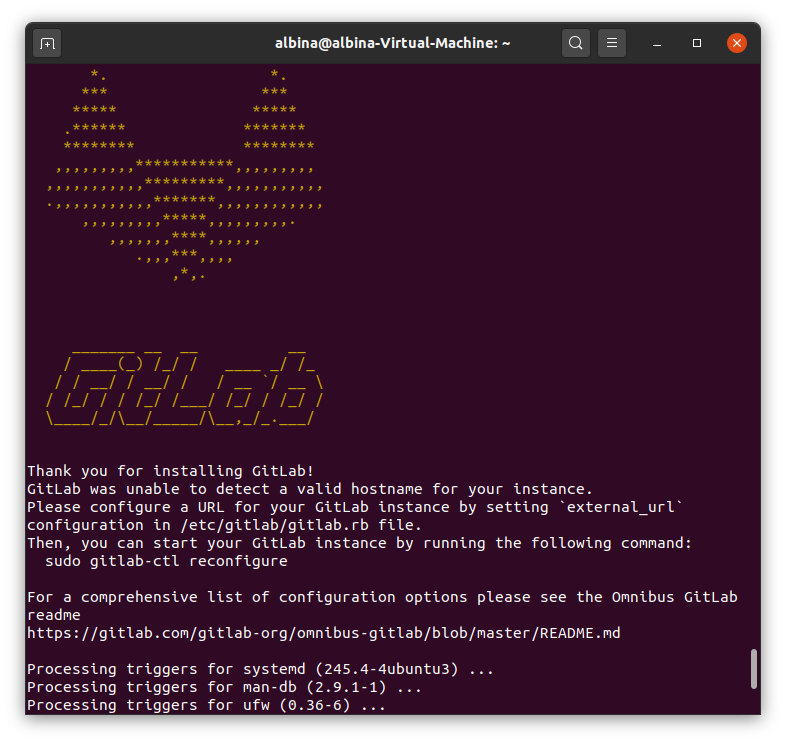
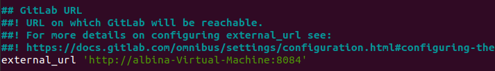
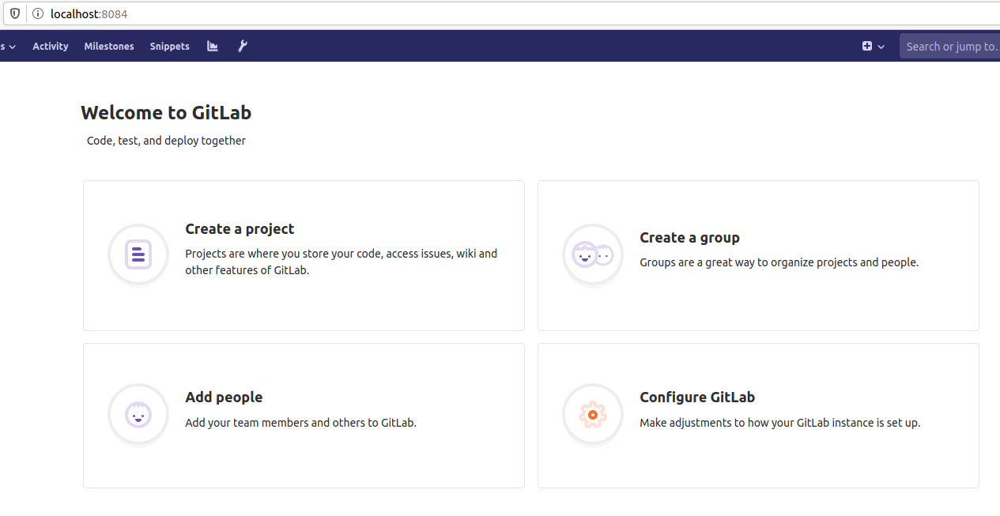
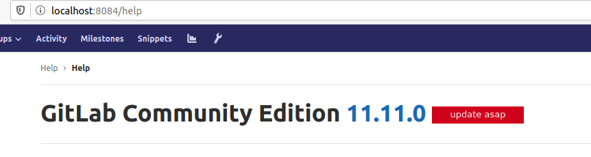

# Migrate GitLab to new Host

## Install GitLab 11.11.0 version

Current GitLab version is 11.11.0:



We need to install the same version to server. Getlab can be installed from https://packages.gitlab.com/gitlab/gitlab-ce?page=71, additionally you  can take a look on official instruction to get information about Manually download and install a GitLab package:
https://docs.gitlab.com/omnibus/manual_install.html

```bash
wget --content-disposition https://packages.gitlab.com/gitlab/gitlab-ce/packages/ubuntu/bionic/gitlab-ce_11.11.0-ce.0_amd64.deb/download.deb

# Install and  setup openssh-server
sudo apt-get install openssh-server
sudo systemctl enable ssh
sudo systemctl start ssh

# GitLab Community Edition
# Debian/Ubuntu
sudo dpkg -i gitlab-ce_11.11.0-ce.0_amd64.deb

```

You should see this output:



Next step - setup and first run Gitlab

```bash
sudo nano /etc/gitlab/gitlab.rb
```
Set external_url parameter to `'http://<hostname>:<port if needed>'`



Save changes and exit: Ctrl+S, Ctrl+X

Then we need to restart Gitlab by command:

```bash
sudo gitlab-ctl reconfigure
```

Go to your site, in my case it is  http://localhost:8084/ and set `root` password, then sing in as root user





Check help page. The version should be the same



## Migrate projects


