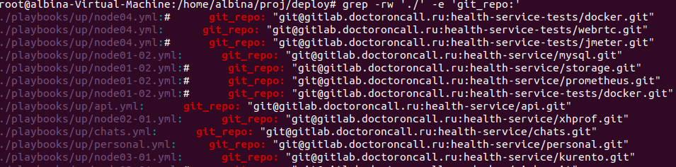

{}

Clone deploy repository from git

```bash
git clone git@gitlab.medzdrav.ru:health-service/deploy.git <path/to/your/project>/health-service/deploy
```

Create ssh key for root user

```bash 
root: sudo su
root: <root user pass>
root: ssh-keygen
```

You should see 2 files in your root ssh repo:

> /root/.ssh/id_rsa
>
> /root/.ssh/id_rsa.pub

Copy text from id_rsa.pub and past it to vagrant run file: `<path/to/your/project>/health-service/deploy/vagrant/run.sh`
Copy text from id_rsa.pub and past it to **gitlab.medzdrav.ru*** Profile->Settings->Add SSH
You should copy id_rsa.pub and id_rsa files to vagrant ssh directory: `<path/to/your/project>/health-service/deploy/vagrant/.ssh`:

```bash
cp /root/.ssh/id_rsa <path/to/your/project>/health-service/deploy/vagrant/.ssh
cp /root/.ssh/id_rsa.pub <path/to/your/project>/health-service/deploy/vagrant/.ssh
```
Check git_repo settings on delpoy folder

```bash
 grep -rw '<path/to/your/project>/health-service/deploy/' -e 'git_repo:'
```



You need to replace git repository with your repository. In my case it is 

```bash
find <path/to/your/project>/health-service/deploy/ -type f -exec sed -i 's/.doctoroncall.ru/.medzdrav.ru/g' {} \;
```


