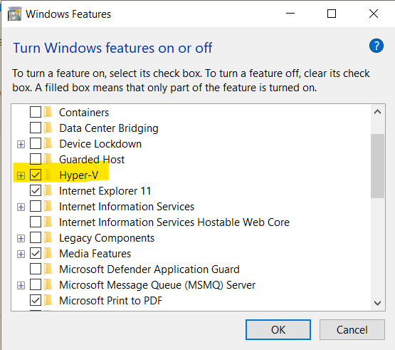
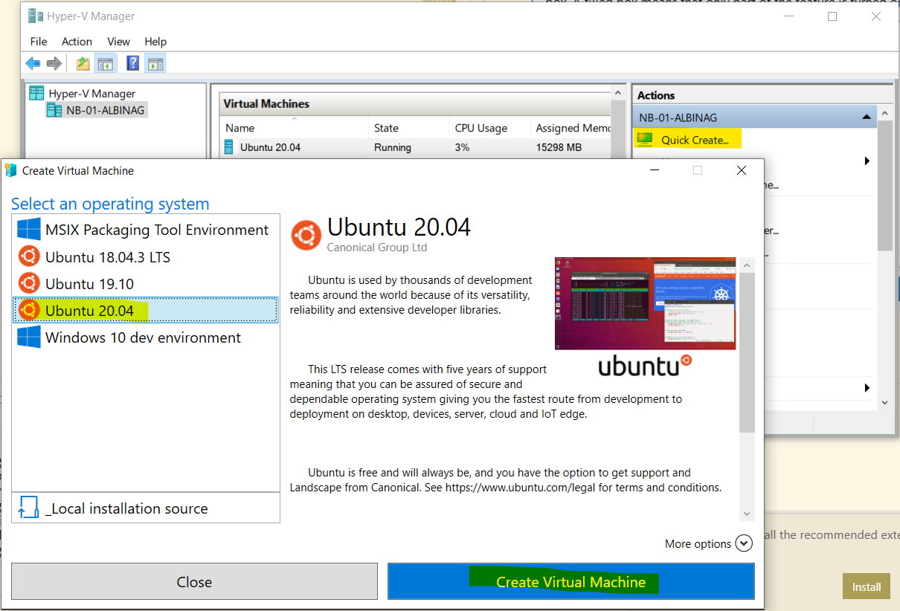
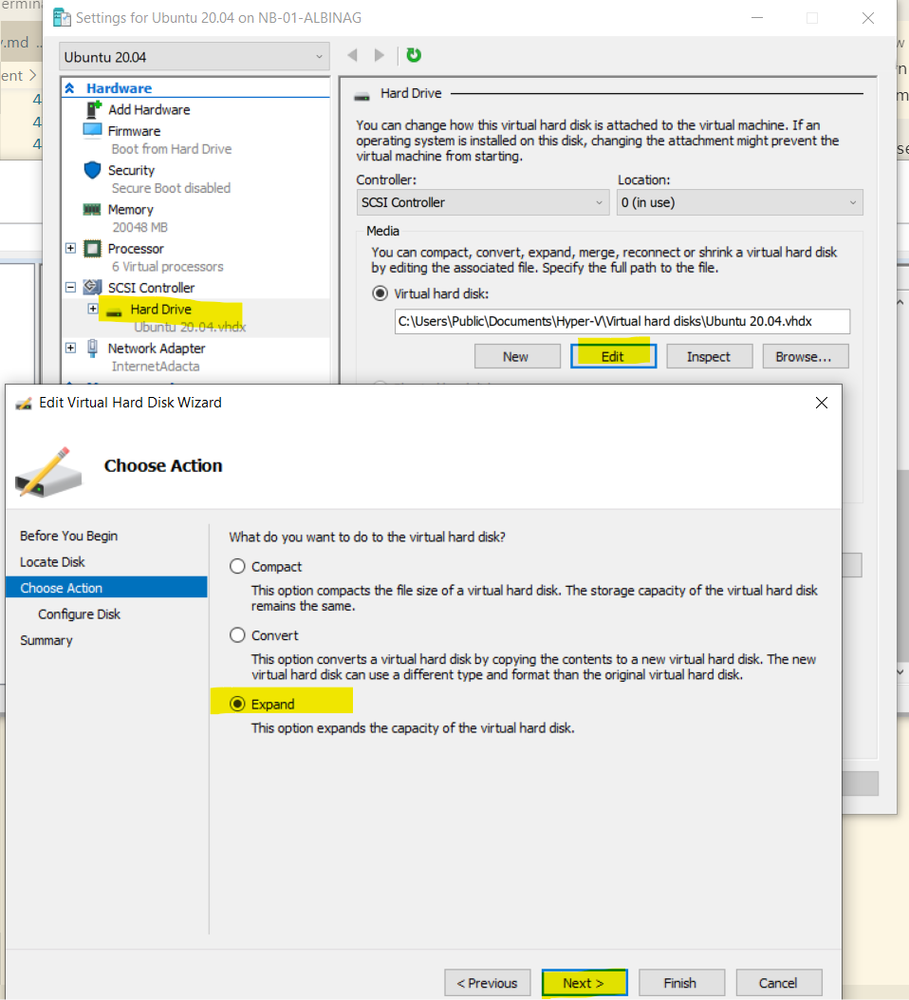
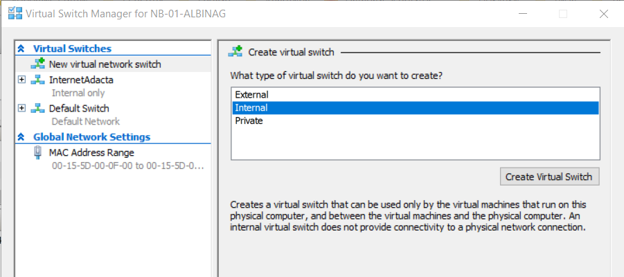
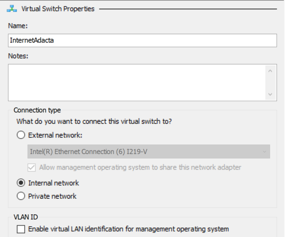
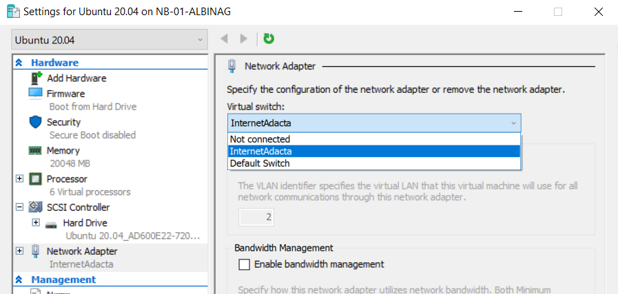
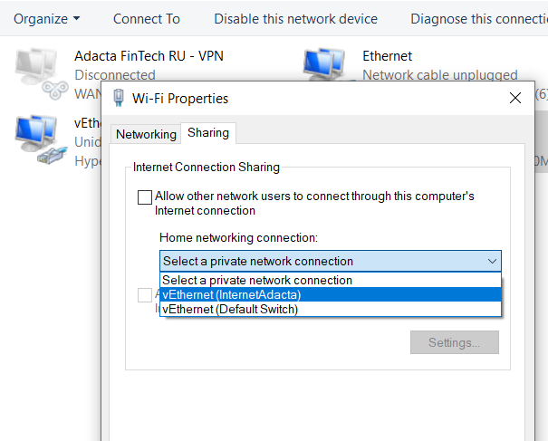
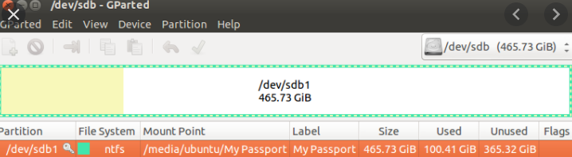

{}

# Hyper-V Ubuntu 20.04

## What Is Hyper-V?

Hyper-V is virtualization software that, well, virtualizes software. It can not only virtualize operating systems but also entire hardware components, such as hard drives and network switches. Unlike Fusion and Virtualbox, Hyper-V is not limited to the user’s device. You can use it for server virtualization, too.

Hyper-V is available in three versions.

* Hyper-V for Windows Servers
* Hyper-V Servers
* Hyper-V on Windows 10

Hyper-V for Windows Servers is an add-on to the Windows Server OS. Hyper-V Servers, on the other hand, is a standalone solution that can be used to manage virtual and dedicated server instances, just like Hyper-V for Windows Servers.

Hyper-V on Windows 10 is the version that runs on your laptop and the subject of this article.

To enable Hyper-V on your Windows device, you need a 64-bit OS. It doesn’t have to be Windows 10, though. Windows 8.1 works too.

Before you get started, you should test your laptop’s hardware performance to make sure your virtual machine will run smoothly. Even if Microsoft says 4GB of RAM is sufficient, you should ideally have 8GB to 16GB. There is a difference between “the software works” and “the software is usable.”

You should also make sure your hard drive has enough space for an additional OS.

## Install Ubuntu 20.04 with Hyper-V

You don't need to install hyper-v from external source, but need to turn it on:

* Open search panel (Win + S) and past `Turn Windows Features on of off`, open this control panel
* Turn Hype-V feature on, restart you computer



* Open search panel (Win + S) and past `Hyper-V Manager`
* On the left tab chose `Quick Create...` action, select Ubuntu 20.04 and push `Create Virtual Machine`



After one minute Ubuntu virtual machine will be installe on you computer. You will see it on `Hyper-V Manager` application on the rigth panel. Save virtual machine name and call command below to turn on virtualization on ubuntu VM. You should open powershell in admin mode:

```powershell
set-vmprocessor -vmname 'Ubuntu 20.04' -exposevirtualizationextension $true
```

### Expand hard drive

By default you have only 12Gb hard drive. We need to expand size.  

* Select `Settings` on the left action panel
* Open `Hard Drive `settings and click `Edit` under Virtual hard disk
* Click `Next`
* Choose `Expand` action and click `Next`
* Set new value



### Share internet access

* Go to Virtual Switch Manager on Action tab
* Create new internal switch, you should set Name only





* Open Settings on Action tab -> Network Adapter and select your new switch



* Press Windows key + X to open the Power User menu and select Network Connections.
*  Right-click the network adapter with an Internet connection (Ethernet or wireless network adapter), then select Properties.
* Click Sharing and select you switch




## Setup ubuntu

* Start ubuntu and set start settings: time, language and so on

### Expand hard drive

To expand memory we need to install GParted. GParted is a free partition editor for graphically managing your disk partitions. With GParted you can resize, copy, and move partitions without data loss. To install GParted open Terminal and typo

```
sudo apt update
sudo apt install GParted
```

then GParted will be enabled with UI. Open search panel (Win + S) and past `GParted`. Expand and save new hard drive size.



### Change resolution

From within the Ubuntu virtual machine, open Terminal and typo
 
```
sudo nano /etc/default/grub
```

Find `GRUB_CMDLINE_LINUX_DEFAULT="quiet splash"`. Append that line with video=hyperv_fb:[specify resolution, e.g. 1024x768]. Here is what it might look like: `GRUB_CMDLINE_LINUX_DEFAULT="quiet splash video=hyperv_fb:1920x1080"`. Save changes and exit

Run the following command: 

```
sudo update-grub
```
Restart the VM

### Install packages

```
sudo apt update
```

#### Curl

```
sudo apt install curl
```

#### Docker


