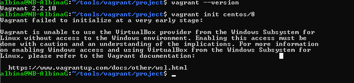

{}

# Install Vagrant and VB to Ubuntu WSL2

Open bash and run commands to download and install vagrant

```bash
sudo apt update

curl -O https://releases.hashicorp.com/vagrant/2.2.10/vagrant_2.2.10_x86_64.deb

sudo apt install ./vagrant_2.2.10_x86_64.deb

vagrant --version

mkdir ~/my-vagrant-project
cd ~/my-vagrant-project

```

You don't need to install VirtualBox on ubuntu, because Vagrant will detect when it is being run within the WSL and adjust how it locates and executes third party executables. For example, when using the VirtualBox provider Vagrant will interact with VirtualBox installed on the Windows system, not within the WSL



# Install Vagrant to Windows

Please, follow the steps from doc:

https://www.vagrantup.com/docs/other/wsl
