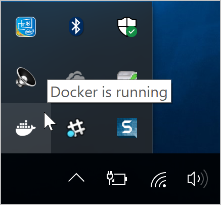

{}

# Setup Ubuntu 20.04 GUI on Windows

## What is WSL

Windows Subsystem for Linux (WSL) allows users to run a Linux terminal environment, install packages from the Ubuntu archive, and run Linux applications and workflows on Windows 10.

### What is WSL 1

The original WSL is now known as WSL1. WSL1 is a compatibility layer for running Linux binary executables (ELF) natively on Windows 10. No re-compilation or 'porting' of applications is required. WSL1 provides a Linux-compatible kernel interface developed by Microsoft that allows a user to choose a Linux distribution to install from the Microsoft Store. WSL1 executes unmodified Linux ELF64 binaries by operating a Linux kernel interface on top of the Windows kernel in Windows 10. The WSL1 interface translates Linux system calls from the binaries into Windows system calls and then executes them at native speed. Linux applications run within the Linux distribution which provides the application's dependencies and package management in a container-like environment. WSL provides an interface to mount drives within WSL.

### What is WSL 2

WSL2 was announced at Microsoft Build 2019. WSL2 features a Linux kernel running inside Windows 10 and is built on the core technology of Hyper-V to provide better Linux application support and improved file performance. Transitioning to WSL2 is seamless. WSL2 is still in active development and is only available in Insider builds. These builds are not suitable for production devices and are not recommended for a user's primary machine. Instead, users can try WSL2 using Hyper-V or on a secondary machine.

## Setup Ubuntu 20.04 GUI on Windows

### Install Ubuntu 20.04

Turn Windows features on and restart computer:

* Windows Subsystem for Linux
* Virtual Machine Platform


Open Microsoft Store and install Ubuntu 20.04:


Launch Ubuntu 20.04 and set user name and password

### Install and set WSL 2

Open PowerShell and run the command:

```markdown
wsl --set-default-version 2
```

Visit installation page from response row if you see this message below, download latest WSL2 Linux kernel update package for you machine and install it:


Open PowerShell and run next commands after  package installation:

```markdown
wsl --set-version Ubuntu-20.04 2
wsl -l -v #check wsl version
wsl --set-default-version 2
```

Return to Ubuntu bash and run commands:

```bash
sudo apt update && sudo apt -y upgrade
sudo apt-get purge xrdp
sudo apt install -y xrdp
sudo apt install -y xfce4
sudo apt install -y xfce4-goodies
sudo cp /etc/xrdp/xrdp.ini /etc/xrdp/xrdp.ini.bak
sudo sed -i ‘s/3389/3390/g’ /etc/xrdp/xrdp.ini
sudo sed -i ‘s/max_bpp=32/#max_bpp=32\nmax_bpp=128/g’ /etc/xrdp/xrdp.ini
sudo sed -i ‘s/xserverbpp=24/#xserverbpp=24\nxserverbpp=128/g’ /etc/xrdp/xrdp.ini
echo xfce4-session > ~/.xsession
```

Then run

```bash
sudo nano /etc/xrdp/startwm.sh
```

And edit lines at the end of document. Startwm.sh should looks like this:


Save document: Ctrl+X, Y, Enter

Run command:

```bash
sudo /etc/init.d/xrdp start
```

Now go to the search box and type Remote Desktop open
Remote Desktop Connection and type localhost:3390 then login using your Ubuntu username and password


<figure class="video_container">
<iframe width="640" height="360" src="https://www.youtube.com/embed/J4Giu5iWigQ" frameborder="0" allowfullscreen="true"></iframe>
</figure>

## Resolving problems

### Internet connection issue

#### Set wsl and resolv configs

If you have ```connect: Network is unreachable```, please run through  commands below to fix it:

* Create a file: ```/etc/wsl.conf```.
* Put the following lines in the file

```markdown
[network]
generateResolvConf = false
```

* In a PowerShell window, run 

```markdown
wsl --shutdown
```

* Launch Ubuntu
* Create a file: ```/etc/resolv.conf```.
If it exists, replace existing one with this new file.
* Put the following lines in the file

```markdown
nameserver 8.8.8.8
```

* In a PowerShell window, run 

```markdown
wsl --shutdown
```

* Launch Ubuntu

* Check connection by using ```host google.com``` or ```ping google.com```

#### Quit Docker Desktop

If you still have no connection, or unable to reach some sites, then Quit Docker Desktop:
* Open the Docker Desktop menu by clicking the Docker icon in the Notifications area (or System tray):

 

* Select Quit Docker Desktop
* In a PowerShell window, run 

```markdown
wsl --shutdown
```

* Launch Ubuntu

#### Turn off VPNs

Check that you have no turned on VPNs on you internet access menu

### Remote Desktop Connection issue

* Launch Ubuntu
* Run in bash

```bash
 sudo /etc/init.d/xrdp start
```

* Reconnect to remote
